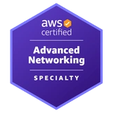
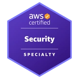
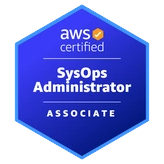
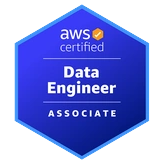
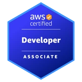
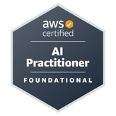
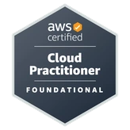
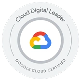

I'm a freelance engineer in Tokyo with 10+ years in web development.
I build Rails apps on AWS, from VPC to deploy, in Terraform or CloudFormation, and use Kubernetes when it fits.
Client repos are private, so I list certifications below instead.

Open to contract work: 1160054@gmail.com

## Certifications

<table>
  <tr>
    <th colspan="2" align="left">AWS</th>
  </tr>
  <tr>
    <td align="center" width="48"></td>
    <td><a href="https://www.credly.com/badges/bd6e6ba7-6396-4e47-9237-bc31071e3c8d">Advanced Networking – Specialty</a></td>
  </tr>
  <tr>
    <td align="center" width="48"></td>
    <td><a href="https://www.credly.com/badges/63360baf-1930-4a6f-993b-7b921acadc9b">Security – Specialty</a></td>
  </tr>
  <tr>
    <td align="center" width="48"></td>
    <td><a href="https://www.credly.com/badges/e0e9ca0f-6ac9-403e-902f-6b8bd6d70a8e">Solutions Architect – Associate</a></td>
  </tr>
  <tr>
    <td align="center" width="48"></td>
    <td><a href="https://www.credly.com/badges/9258fd8d-f6db-4b22-b4ce-90b1c63f58a9">SysOps Administrator – Associate</a></td>
  </tr>
  <tr>
    <td align="center" width="48"></td>
    <td><a href="https://www.credly.com/badges/74859646-1041-48ec-9367-b5074b668f5b">Data Engineer – Associate</a></td>
  </tr>
  <tr>
    <td align="center" width="48"></td>
    <td><a href="https://www.credly.com/badges/bf0b8047-ac1d-4fb4-a73e-e1659ec76bb3">Developer – Associate</a></td>
  </tr>
  <tr>
    <td align="center" width="48"></td>
    <td><a href="https://www.credly.com/badges/640f372b-9c45-4779-b706-324c5589e5d9">AI Practitioner</a></td>
  </tr>
  <tr>
    <td align="center" width="48"></td>
    <td><a href="https://www.credly.com/badges/d905da15-8da2-4181-93a1-d27d9ffdb10e">Cloud Practitioner</a></td>
  </tr>
</table>
<table>
  <tr>
    <th colspan="2" align="left">CNCF / The Linux Foundation</th>
  </tr>
  <tr>
    <td align="center" width="48"></td>
    <td><a href="https://www.credly.com/badges/d668dda4-2472-4617-bfc6-e47ffdb27038">CKAD: Certified Kubernetes Application Developer</a></td>
  </tr>
</table>
<table>
  <tr>
    <th colspan="2" align="left">Google Cloud</th>
  </tr>
  <tr>
    <td align="center" width="48"></td>
    <td><a href="https://www.credly.com/badges/07f0b6d1-f426-41c4-a138-ba1b43e549ca">Cloud Digital Leader</a></td>
  </tr>
</table>

**Others**

- Applied Information Technology Engineer (応用情報技術者, IPA)
- Ruby Association Certified Ruby Programmer Silver
